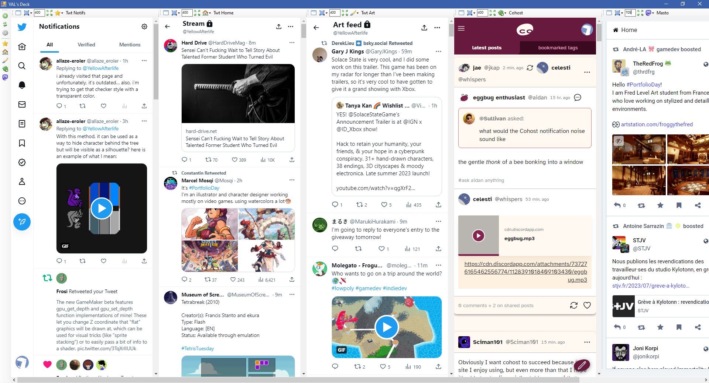
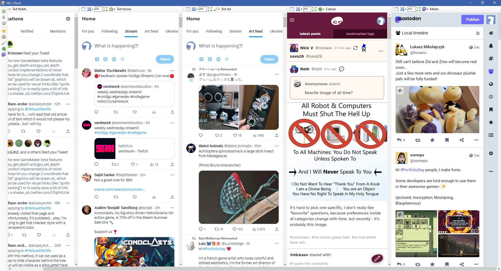
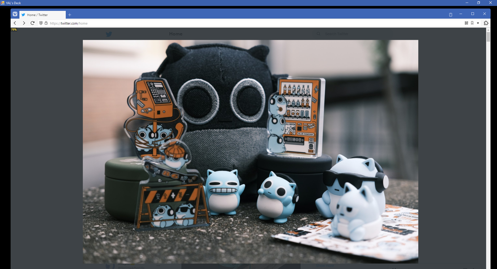

# YAL's Deck (working title)

**Quick links:** [itch.io](https://yellowafterlife.itch.io/deck) (donations, pre-built binaries) · [demo video](media/demo.mp4)

This little tool allows you to embed multiple windows into a horizontally scrolling view!

In doing so, you can combine several feeds from unrelated social media pages into a sort of "universal dashboard".
But you aren't limited to just web pages - almost any application can be embedded into the tool.

## How to use

- Click on the "+" button on the sidebar to add a column
- Press Insert/Remove Window in the column's toolbar
- Click on (or otherwise give focus to) your window to embed it into the program
- You can un-embed a window later by pressing the Insert/Remove button again.
- If you need to take a closer look at a column, you can press on Expand to show it in an individual view.  
	Clicking outside of the window will return to regular view.
- Columns can be re-arranged or removed using a drop-down menu near the column name.
- The same menu can be used to change the name and icon of a column.
- Text fields inside the column header allows you to change column widths (in pixels).
- Crop menu allows you to change how much will be subtracted from each side of the window (typically to remove window frames).

## DeckLightbox (optional)

This little browser extension replaces the default image viewer on Twitter/Cohost/Mastodon with a fancier one than can be panned around and zoomed.

It also tells the tool (by sending an HTTP request) to expand the column
when opening the image viewer and to collapse it when closing the image viewer.

This allows the dashboard to behave as if the columns aren't self-contained, which feels very nice.

How to install

**Note:** If you are using Mastodon, you'll have to edit `manifest.json` to include your domain(s) -
the default is just the `mastodon.gamedev.place`.

Enable "developer mode" at `chrome://extensions/` and "load unpacked" the DeckLightbox directory from the repo.

Firefox considers the extension to be corrupt but this might be a fixable oversight.

## Caveats

- Some rendering (most notably custom window frames in browsers) gets glitchy while dragging them inside the tool.
- Giving focus to an embedded window window deactivates the tool window, which is technically correct but looks weird.
- The window does not auto-detect being maximized/restored, but you can press "refresh" button on the left.

## Alternatives

Vivaldi's [tab tiling](https://help.vivaldi.com/desktop/tabs/tab-tiling/) can display multiple tabs in a column/row/grid view, though without ability to scroll through them or quickly expand a section.

## On Electron

This could be achieved using `BrowserWindow.addBrowserView` in Electron,
but that's both less flexible than utilizing an existing browser
and may considered suspicious by websites themselves.

## Meta

**Author:** YellowAfterlife  
**License:** [GPLv3](https://www.gnu.org/licenses/gpl-3.0.en.html)